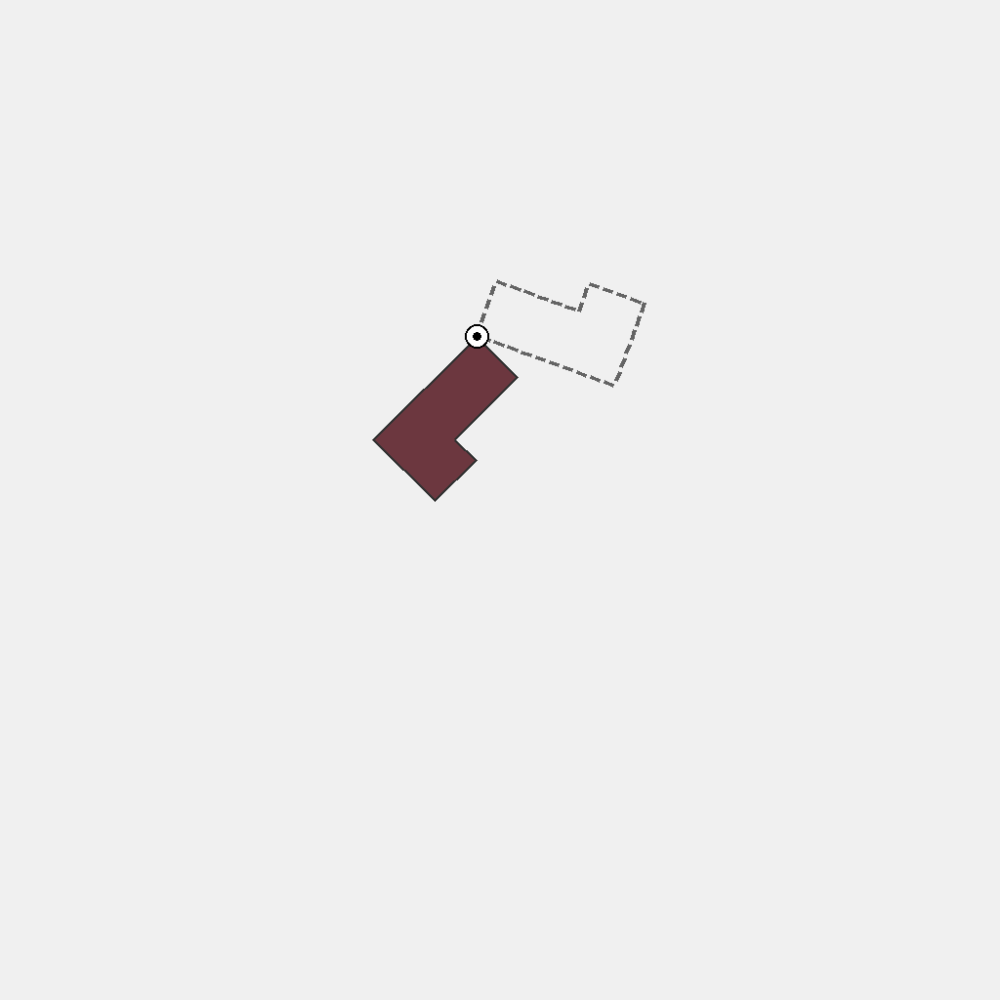
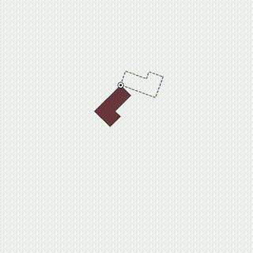
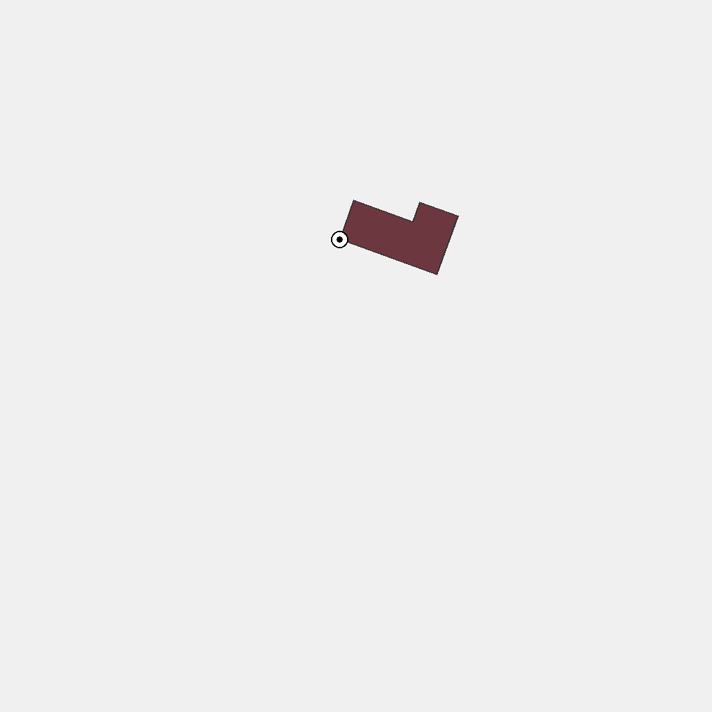

# O-6: 2D Geometric Transformation Data Generator

Generates synthetic tasks where a colored 2D polygon is shown with a rotation center and dashed target outline. The goal is to rotate the polygon clockwise around the center until it matches the target orientation.

Each sample pairs a **task** (first frame + prompt describing what needs to happen) with its **ground truth solution** (final frame showing the result + video demonstrating how to achieve it). This structure enables both model evaluation and training.

---

## 📌 Basic Information

| Property | Value |
|----------|-------|
| **Task ID** | O-6 |
| **Task** | 2D Geometric Transformation |
| **Category** | Transformation |
| **Resolution** | 1024×1024 px |
| **FPS** | 15 fps |
| **Duration** | ~4.7 seconds |
| **Output** | PNG images + MP4 video |

---

## 🚀 Usage

### Installation

```bash
# Clone the repository
git clone https://github.com/VBVR-DataFactory/O-6_2d_geometric_transformation_data-generator.git
cd O-6_2d_geometric_transformation_data-generator

# Install dependencies
pip install -r requirements.txt
```

### Generate Data

```bash
# Generate 100 samples
python examples/generate.py --num-samples 100

# Generate with specific seed
python examples/generate.py --num-samples 100 --seed 42

# Generate without videos
python examples/generate.py --num-samples 100 --no-videos

# Custom output directory
python examples/generate.py --num-samples 100 --output data/my_output
```

### Command-Line Options

| Argument | Type | Description | Default |
|----------|------|-------------|---------|
| `--num-samples` | int | Number of samples to generate | 100 |
| `--seed` | int | Random seed for reproducibility | Random |
| `--output` | str | Output directory | data/questions |
| `--no-videos` | flag | Skip video generation | False |

---

## 📖 Task Example

### Prompt

```
The scene shows a colored 2D polygon, a rotation center marked by a small circular marker, and a dashed target outline indicating the final orientation. Only orientation changes. Rotate the polygon in the counterclockwise direction. First note the polygon’s initial orientation and the marked center, then read the dashed outline to know the target orientation. Rotate the polygon counterclockwise around the center until it completely overlaps the dashed outline with no offset. Keep size unchanged, keep a line to the center, and end with the polygon exactly matching the dashed outline.
```
### Visual

<table>
<tr>
  <td align="center"></td>
  <td align="center"></td>
  <td align="center"></td>
</tr>
<tr>
  <td align="center"><b>Initial Frame</b><br/>Polygon with center and target outline</td>
  <td align="center"><b>Animation</b><br/>Polygon rotates clockwise to target</td>
  <td align="center"><b>Final Frame</b><br/>Polygon matches dashed outline</td>
</tr>
</table>

---

## 📖 Task Description

### Objective

Rotate a 2D polygon clockwise around a marked center point until it exactly matches the orientation shown by the dashed target outline.

### Task Setup

- **Polygon**: Colored 2D geometric shape (various polygons)
- **Rotation Center**: Small circular marker indicating the pivot point
- **Target Outline**: Dashed line showing the final orientation
- **Rotation Direction**: Clockwise only
- **Size Constraint**: Polygon size must remain unchanged
- **Alignment**: Final polygon must exactly overlap the dashed outline

### Key Features

- **Rotation transformation**: Tests understanding of 2D rotation around a point
- **Center identification**: Recognizing and using the marked rotation center
- **Target matching**: Rotating to match a specific target orientation
- **Clockwise constraint**: Following specific rotation direction
- **Size preservation**: Maintaining original polygon dimensions
- **Precise alignment**: Achieving exact overlap with target outline

---

## 📦 Data Format

```
data/questions/2d_geometric_transformation_task/2d_geometric_transformation_00000000/
├── first_frame.png      # Initial state (polygon and target outline)
├── final_frame.png      # Goal state (polygon rotated to target)
├── prompt.txt           # Task instructions
├── ground_truth.mp4     # Solution video (15 fps)
└── question_metadata.json # Task metadata
```


**File specifications**: Images are 1024×1024 PNG. Videos are MP4 at 15 fps, approximately 4.7 seconds long.

---

## 🏷️ Tags

`geometric-transformation` `rotation` `2d-geometry` `clockwise-rotation` `target-matching` `spatial-reasoning` `orientation-change`

---
