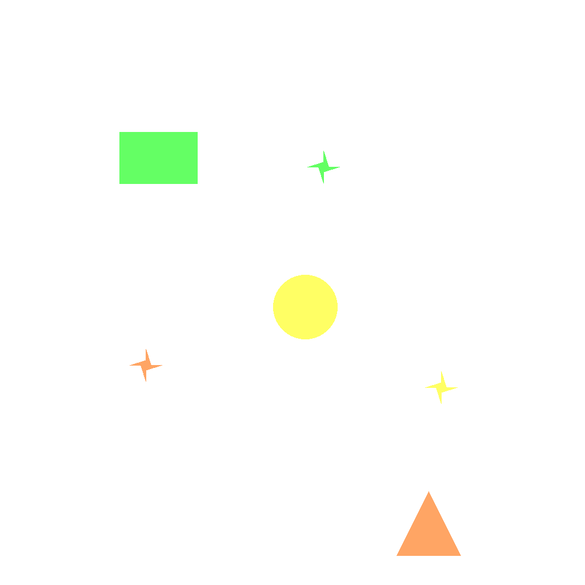
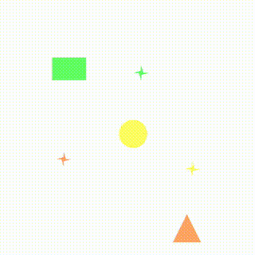
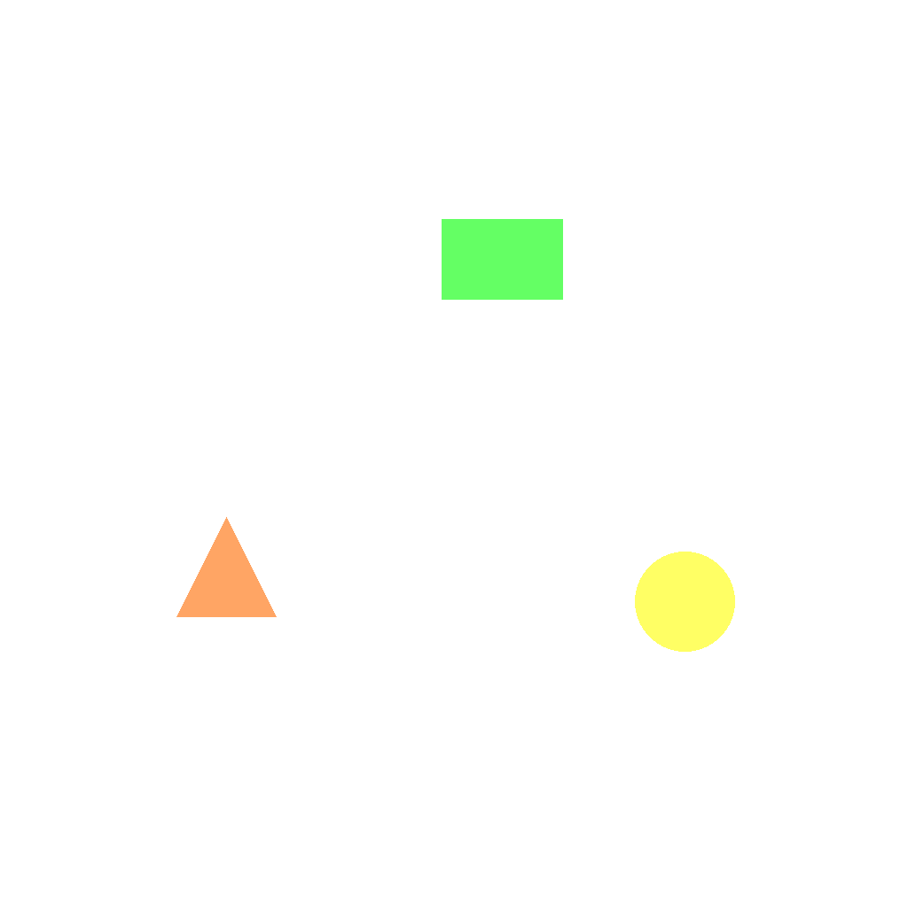

# G-5: Multi Object Placement Data Generator

Generates synthetic datasets for training and evaluating vision models on multi-object placement tasks. Each sample contains multiple colored objects and matching star markers, requiring the model to place each object on its corresponding color-matched marker.

Each sample pairs a **task** (first frame + prompt describing what needs to happen) with its **ground truth solution** (final frame showing the result + video demonstrating how to achieve it). This structure enables both model evaluation and training.

---

## 📌 Basic Information

| Property | Value |
|----------|-------|
| **Task ID** | G-5 |
| **Task** | Multi Object Placement |
| **Category** | Perception |
| **Resolution** | 1024×1024 px |
| **FPS** | 16 fps |
| **Duration** | ~3 seconds |
| **Output** | PNG images + MP4 video |

---

## 🚀 Usage

### Installation

```bash
# 1. Clone the repository
git clone https://github.com/VBVR-DataFactory/G-5_multi_object_placement_data-generator.git
cd G-5_multi_object_placement_data-generator

# 2. Create and activate virtual environment
python3 -m venv venv
source venv/bin/activate  # On Windows: venv\Scripts\activate

# 3. Install dependencies
pip install --upgrade pip
pip install -r requirements.txt
pip install -e .
```

### Generate Data

```bash
# Generate 50 samples
python examples/generate.py --num-samples 50

# Custom output directory
python examples/generate.py --num-samples 100 --output data/my_dataset

# Reproducible generation with seed
python examples/generate.py --num-samples 50 --seed 42

# Without videos (faster)
python examples/generate.py --num-samples 50 --no-videos
```

### Command-Line Options

| Argument | Description |
|----------|-------------|
| `--num-samples` | Number of tasks to generate (required) |
| `--output` | Output directory (default: `data/questions`) |
| `--seed` | Random seed for reproducibility |
| `--no-videos` | Skip video generation (images only) |

---

## 📖 Task Example

### Prompt

```
The scene contains multiple colored objects and star markers. Keep all star markers unchanged in position. Move each colored object to the star marker with the same color using straight paths, aligning the center of each object with the center of its matching star marker.
```
### Visual

<table>
<tr>
  <td align="center"></td>
  <td align="center"></td>
  <td align="center"></td>
</tr>
<tr>
  <td align="center"><b>Initial Frame</b><br/>Objects and markers at random positions</td>
  <td align="center"><b>Animation</b><br/>Objects move to matching colored markers</td>
  <td align="center"><b>Final Frame</b><br/>Each object placed on its matching marker</td>
</tr>
</table>

---

## 📖 Task Description

### Objective
Place each colored object on the star marker with the matching color using straight-line paths while keeping all star markers in their original positions.

### Task Setup
- **Object count**: 2-5 objects per scene
- **Shapes**: Circle, square, rectangle, triangle
- **Colors**: Red, green, blue, yellow, purple, orange
- **Markers**: Four-pointed star shapes matching object colors
- **Background**: Pure white
- **Goal**: Align each object's center with its matching marker's center

### Key Features
- Color-matching constraint: each object must go to the marker with the same color
- Star markers remain stationary throughout the animation
- Objects move along straight paths (no curved trajectories)
- Strict non-occlusion constraint: objects and markers never overlap in initial frame (except in final frame where objects cover their markers)
- Smart layout generation with multiple strategies (grid, circular, scatter) to ensure valid spacing
- Minimum spacing enforced between objects (120px), between markers (220px), and between objects and markers (120px)

---

## 📦 Data Format

```
data/questions/multi_object_placement_task/multi_object_placement_00000000/
├── first_frame.png      # Objects and markers at initial positions
├── final_frame.png      # Objects placed on matching markers
├── prompt.txt           # Placement instruction
├── ground_truth.mp4     # Animation of placement process
└── question_metadata.json # Task metadata
```


**File specifications:**
- **Images**: 1024×1024 PNG format
- **Video**: MP4 format, 16 fps
- **Duration**: ~3 seconds

---

## 🏷️ Tags

`spatiality` `color-matching` `object-placement` `path-planning` `visual-reasoning`

---
