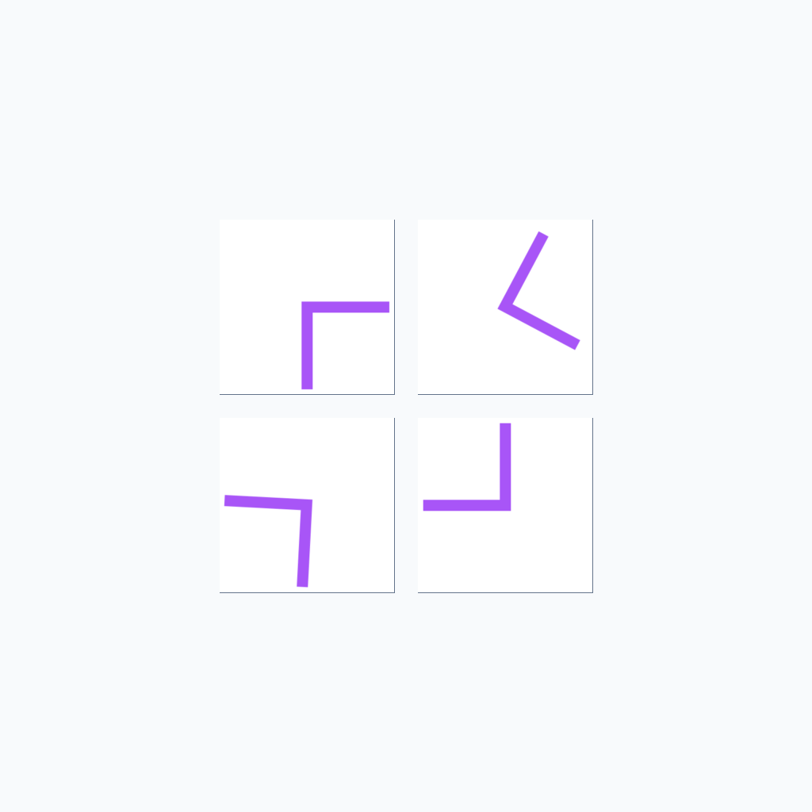
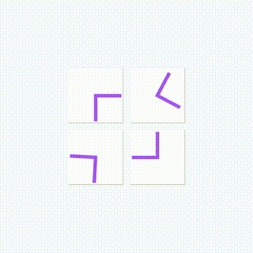
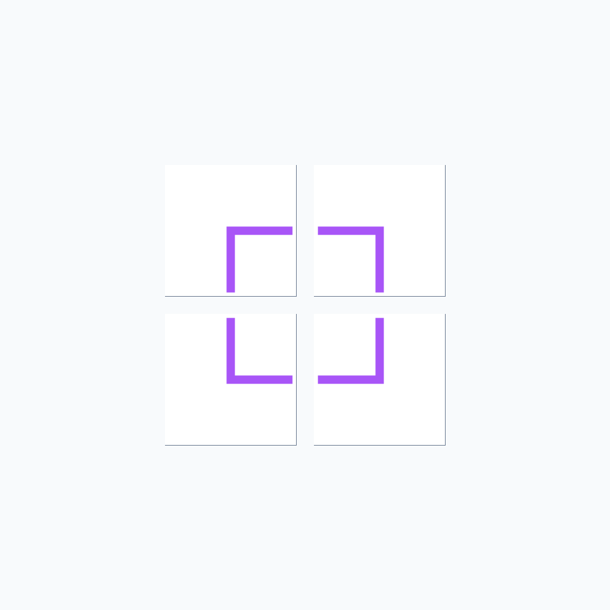

# O-44: Rotation Puzzle Data Generator

Generates synthetic spatial reasoning tasks where four L-shaped pipes must be rotated to connect properly and form a complete square frame. Tests understanding of rotation, angle manipulation, and spatial connection logic.

Each sample pairs a **task** (first frame + prompt describing what needs to happen) with its **ground truth solution** (final frame showing the result + video demonstrating how to achieve it). This structure enables both model evaluation and training.

---

## 📌 Basic Information

| Property | Value |
|----------|-------|
| **Task ID** | O-44 |
| **Task** | Rotation Puzzle |
| **Category** | Transformation |
| **Resolution** | 1024×1024 px |
| **FPS** | 16 fps |
| **Duration** | varies |
| **Output** | PNG images + MP4 video |

---

## 🚀 Usage

### Installation

```bash
# Clone the repository
git clone https://github.com/VBVR-DataFactory/O-44_rotation_puzzle_data-generator.git
cd O-44_rotation_puzzle_data-generator

# Install dependencies
pip install -r requirements.txt
```

### Generate Data

```bash
# Generate 100 samples
python examples/generate.py --num-samples 100

# Generate with specific seed
python examples/generate.py --num-samples 100 --seed 42

# Generate without videos
python examples/generate.py --num-samples 100 --no-videos

# Custom output directory
python examples/generate.py --num-samples 100 --output data/my_output
```

### Command-Line Options

| Argument | Type | Description | Default |
|----------|------|-------------|---------|
| `--num-samples` | int | Number of samples to generate | 100 |
| `--seed` | int | Random seed for reproducibility | Random |
| `--output` | str | Output directory | data |
| `--no-videos` | flag | Skip video generation | False |

---

## 📖 Task Example

### Prompt

```
Solve this rotation puzzle by rotating the four squares to connect the pipe paths. Each square can be rotated 90 degrees clockwise or counterclockwise. Rotate the squares so that all pipe paths connect to form a continuous path. Keep the camera view fixed in the top-down perspective and maintain all square positions unchanged. Stop the video when all pipes are connected and the puzzle is solved.
```
### Visual

<table>
<tr>
  <td align="center"></td>
  <td align="center"></td>
  <td align="center"></td>
</tr>
<tr>
  <td align="center"><b>Initial Frame</b><br/>L-shaped pipes at random angles</td>
  <td align="center"><b>Animation</b><br/>Pipes rotating to connect</td>
  <td align="center"><b>Final Frame</b><br/>Complete square frame formed</td>
</tr>
</table>

---

## 📖 Task Description

### Objective

Rotate four L-shaped pipe segments to form a connected square frame where all pipe ends meet properly at corners, creating a complete loop.

### Task Setup

- **Number of Pipes**: 4 L-shaped pipes in a 2×2 grid arrangement
- **Pipe Size**: Each pipe segment is 220×220 pixels with 3px borders
- **Spacing**: 30 pixels between pipes
- **Rotation Angles**: Pipes can be oriented at any angle from 1° to 359°
- **Color Options**: Multiple colors (randomly selected from 20-color palette)
- **Pipe Width**: 14 pixels for clear visibility
- **Difficulty Levels**: Easy, medium, or hard based on initial misalignment

### Key Features

- **Rotation reasoning**: Tests understanding of how rotation transforms spatial orientation
- **Connection logic**: Requires identifying which pipes need rotation to connect properly
- **Arbitrary angle rotation**: Supports any rotation angle from 1° to 359° for maximum challenge
- **Spatial planning**: Must visualize the final connected configuration
- **Selective rotation**: Only pipes that need adjustment should rotate, others stay stationary
- **Smooth animation**: 64-frame smooth rotation animation with ease-in-out for natural movement
- **Visual variety**: 20 distinct pipe colors for diverse visual appearance

---

## 📦 Data Format

```
data/questions/rotation_puzzle_task/rotation_puzzle_00000000/
├── first_frame.png      # Initial state (pipes at random angles)
├── final_frame.png      # Final state (connected square frame)
├── prompt.txt           # Task instructions
├── ground_truth.mp4     # Solution video (16 fps)
└── question_metadata.json # Task metadata
```


**File specifications**: Images are 1024×1024 PNG. Videos are MP4 at 16 fps, duration varies by number of rotations needed.

---

## 🏷️ Tags

`spatial-reasoning` `rotation` `angle-manipulation` `connection-logic` `puzzle-solving` `geometric-transformation` `visual-planning`

---
