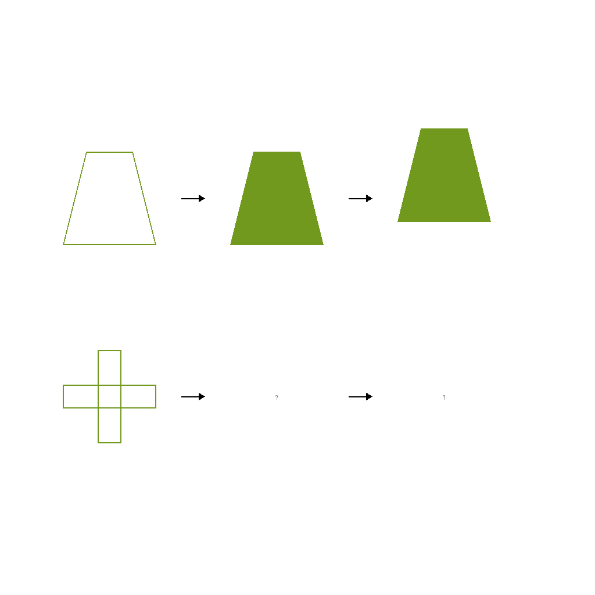
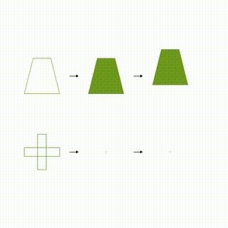
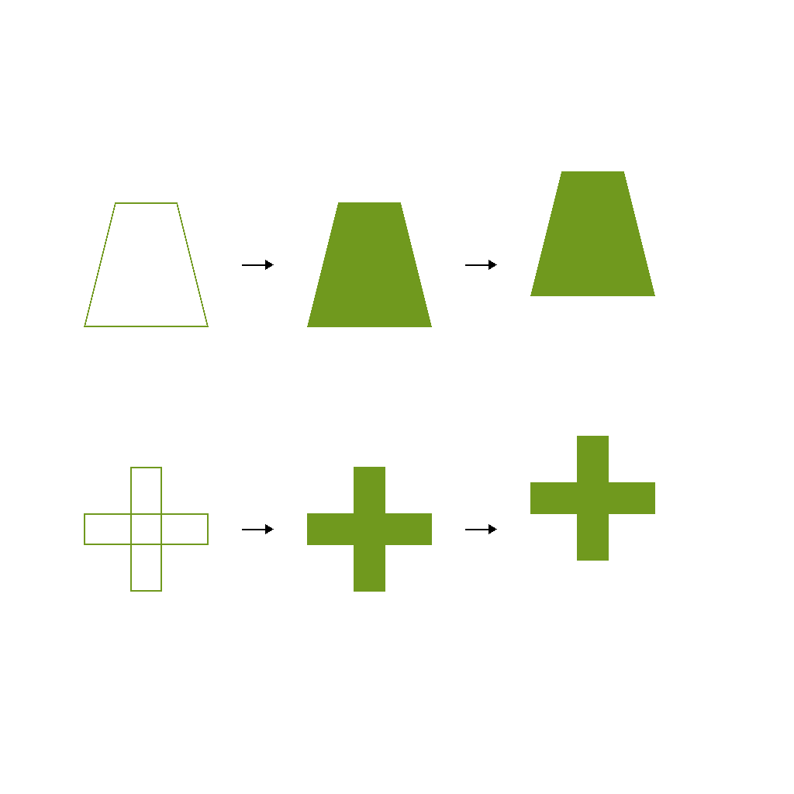

# O-13: Shape Outline Then Move Data Generator

Generates synthetic visual reasoning tasks demonstrating sequential transformations: first outline-only conversion (filled to outline), then position movement. The task presents a two-row analogy (A→B→C :: D→?→?) where shapes undergo the same two-step transformation pattern.

Each sample pairs a **task** (first frame + prompt describing what needs to happen) with its **ground truth solution** (final frame showing the result + video demonstrating how to achieve it). This structure enables both model evaluation and training.

---

## 📌 Basic Information

| Property | Value |
|----------|-------|
| **Task ID** | O-13 |
| **Task** | Shape Outline Then Move |
| **Category** | Abstraction |
| **Resolution** | 1024×1024 px |
| **FPS** | 16 fps |
| **Duration** | ~5 seconds |
| **Output** | PNG images + MP4 video |

---

## 🚀 Usage

### Installation

```bash
# Clone the repository
git clone https://github.com/VBVR-DataFactory/O-13_shape_outline_then_move_data-generator.git
cd O-13_shape_outline_then_move_data-generator

# Install dependencies
pip install -r requirements.txt
```

### Generate Data

```bash
# Generate 100 samples
python examples/generate.py --num-samples 100

# Generate with specific seed
python examples/generate.py --num-samples 100 --seed 42

# Generate without videos
python examples/generate.py --num-samples 100 --no-videos

# Custom output directory
python examples/generate.py --num-samples 100 --output data/my_output
```

### Command-Line Options

| Argument | Type | Description | Default |
|----------|------|-------------|---------|
| `--num-samples` | int | Number of samples to generate | 100 |
| `--seed` | int | Random seed for reproducibility | Random |
| `--output` | str | Output directory | data |
| `--no-videos` | flag | Skip video generation | False |

---

## 📖 Task Example

### Prompt

```
The scene shows an analogy A→B→C :: D→?→? with two rows of shapes and arrows. On the top row, a filled trapezoid first becomes an outline-only trapezoid (step 1), then moves up by a small amount (step 2). On the bottom row, the cross starts filled. Apply the same two-step transformation: first convert it to outline-only style, then move it up by a small amount, keeping its shape and size the same while only the style and position change.
```
### Visual

<table>
<tr>
  <td align="center"></td>
  <td align="center"></td>
  <td align="center"></td>
</tr>
<tr>
  <td align="center"><b>Initial Frame</b><br/>Two-row analogy with shapes</td>
  <td align="center"><b>Animation</b><br/>Filled to outline then position moves</td>
  <td align="center"><b>Final Frame</b><br/>Completed transformation sequence</td>
</tr>
</table>

---

## 📖 Task Description

### Objective

Complete a visual analogy by applying a two-step sequential transformation: first converting a filled shape to outline-only style, then changing its position. The bottom row shape must follow the same transformation pattern demonstrated in the top row.

### Task Setup

- **Two-Row Analogy**: Top row shows example transformation (A→B→C), bottom row requires completion (D→?→?)
- **Sequential Transformations**: Two distinct steps applied in order (outline conversion first, then movement)
- **Outline Conversion**: Filled shape becomes outline-only (hollow) shape - this generator modifies the **style** parameter first, then the **position** parameter, demonstrating sequential modifications of both style and spatial properties
- **Position Movement**: Shape moves vertically (up or down) after outline conversion
- **Shape Variation**: Different shapes in top and bottom rows (e.g., circle vs square)

### Key Features

- **Sequential reasoning**: Tests ability to recognize and apply multi-step transformations in correct order
- **Transformation decomposition**: Separates style change (filled to outline) and position change into distinct steps
- **Pattern generalization**: Applies learned pattern from one shape to a different shape
- **Temporal ordering**: Outline conversion occurs before position movement
- **Visual analogy**: A→B→C :: D→?→? structure tests analogical reasoning
- **Style transformation**: Tests understanding of fill vs outline rendering modes
- **Shape preservation**: Size and shape remain constant while style and position change
- **Large-scale diversity**: 20 distinct shapes, 400 colors, 4 style types, and 11 movement directions for extensive variety (200M+ unique combinations)

---

## 📦 Data Format

```
data/questions/shape_outline_then_move_task/shape_outline_then_move_00000000/
├── first_frame.png      # Initial state (two-row analogy setup)
├── final_frame.png      # Final state (completed transformation)
├── prompt.txt           # Task instructions
├── ground_truth.mp4     # Solution video (16 fps)
└── question_metadata.json # Task metadata
```


**File specifications**: Images are 1024×1024 PNG. Videos are MP4 at 16 fps, approximately 5 seconds long.

---

## 🏷️ Tags

`sequential-transformation` `visual-analogy` `outline-conversion` `fill-to-outline` `position-movement` `multi-step-reasoning` `pattern-recognition` `analogical-reasoning`

---
