# Video-SSL physics-editing evaluation: base vs T0 / T2 / T3

Suite design, selection and planned power: [`../SUITE.md`](../SUITE.md). Every number below is read from the CSVs in this folder (`ssl_physics_suite/analyze.py` → `report.py`).

> **Judge caveat.** All VLM scores come from Qwen3-VL-30B-A3B-Instruct-FP8 (vLLM, temperature 0) running each benchmark's official judge prompts and parsers. They are **not comparable to published GPT-4o/4.1-judged leaderboard numbers**. Compare only across our four models.

## Setup

- Resolution: area ~512x512, input aspect ratio kept, both sides rounded to a multiple of 16 (same rule as v2 training --gen_resize_mode area --gen_image_size 512); the conditioning image is resized (LANCZOS) to the same size
- Sampler: DPMSolverMultistepScheduler (dpmsolver++, flow_shift 3.0) from each checkpoint's scheduler/ config (identical across the 4), 20 steps, all_cfg_scale 4.5, part_cfg_scale 2.0
- Seed: 42 (torch.Generator(cuda).manual_seed(42) re-created for every task)
- Prompt: the benchmark instruction verbatim, no system prompt override, no prefix/suffix (PhyEditBench TypeD uses the official packed-steps wrapper; PICABench uses superficial_prompt)

- Checkpoints: **base** `/scratch/network/ssd2/junlin/huggingface/hub/models--InternVL-U--InternVL-U/snapshots/f012d760e69712bb47f7d3d09a24280f346cee01`; **T0** `/scratch/network/ssd/junlin/models/internvlu-v2-t0-gen-merged`; **T2** `/scratch/network/ssd/junlin/models/internvlu-v2-t2-gen-merged`; **T3** `/scratch/network/ssd/junlin/models/internvlu-v2-t3-gen-merged`

- Per-benchmark judging: PhyEditBench `utils.score_one_dimension` (4 dims, 1–10; overall = 0.4·Phys+0.3·Instr+0.2·Cons+0.1·Qual); Anti-Physics `gpt_eval_anti.vlm_judge` + official checklists; PICABench `PicaEval_qwen` ROI-crop yes/no QA (Acc = mean per-sample QA accuracy) + official masked PSNR (Con, 512); RISEBench `gpt_eval.eval_vanilla` (Reasoning/Consistency/Plausibility 1–5; Acc = all applicable dims = 5; Score = official weighted 1–5); ImgEdit `basic_bench` type-specific prompts and `step1` parser; UGE `UGE_bench`; MagicBrush L1/CLIP-I/DINO vs GT + the UGE (type-agnostic ImgEdit) rubric.

- Parse policy: official parser first; on failure the call is retried up to 3× (temperature 0.7, seeded) and every attempt is logged; residual failures are kept and shown below. UGE/MagicBrush add a documented `Score: N` fallback because the official UGE prompt defines no score line.

## Evidence-group summary

Δ = trained − base on the benchmark's primary per-item metric scaled to 0–1 of its range (PhyEditBench overall, Anti overall, PICABench Acc, RISE Score, ImgEdit/UGE/MagicBrush VLM score), pooled over all items in the group. The CI is a cluster bootstrap (10k resamples; a PhyEditBench trajectory is one cluster). p is a Wilcoxon signed-rank test on cluster means, Holm-adjusted over T0/T2/T3; * p<0.05, ** p<0.01. Realised MDE = 2.8·SD(Δ)/√n.

| group | model | n | Δ (norm.) | 95% CI | p (Holm) | realised MDE |
|---|---|---:|---:|---|---:|---:|
| A · Target | T0 | 950 | -0.026** | [-0.046, -0.007] | 0.001 | 0.036 |
| A · Target | T2 | 950 | -0.010* | [-0.028, +0.008] | 0.018 | 0.033 |
| A · Target | T3 | 950 | -0.025** | [-0.044, -0.007] | 0.001 | 0.035 |
| A · Target | copy | 950 | -0.113 | [-0.144, -0.085] | – | 0.046 |
| B · Secondary | T0 | 60 | -0.134 | [-0.252, -0.021] | 0.156 | 0.165 |
| B · Secondary | T2 | 60 | -0.158* | [-0.261, -0.057] | 0.032 | 0.149 |
| B · Secondary | T3 | 60 | -0.117 | [-0.229, -0.007] | 0.156 | 0.159 |
| B · Secondary | copy | 60 | -0.117 | [-0.247, +0.014] | – | 0.189 |
| C · Controls | T0 | 195 | -0.015 | [-0.058, +0.027] | 1.000 | 0.061 |
| C · Controls | T2 | 195 | +0.004 | [-0.029, +0.038] | 0.952 | 0.048 |
| C · Controls | T3 | 195 | -0.011 | [-0.047, +0.026] | 1.000 | 0.053 |
| C · Controls | copy | 193 | -0.289 | [-0.357, -0.222] | – | 0.097 |
| A* · Target without PhyEditBench-normal (post-hoc) | T0 | 470 | -0.090** | [-0.120, -0.060] | 0.000 | 0.042 |
| A* · Target without PhyEditBench-normal (post-hoc) | T2 | 470 | -0.065** | [-0.092, -0.038] | 0.000 | 0.038 |
| A* · Target without PhyEditBench-normal (post-hoc) | T3 | 470 | -0.088** | [-0.116, -0.059] | 0.000 | 0.041 |
| A* · Target without PhyEditBench-normal (post-hoc) | copy | 470 | -0.296 | [-0.332, -0.259] | – | 0.051 |

Group means per model (normalised), T0 → T2 → T3 trend:

| group | base | T0 | T2 | T3 | copy |
|---|---:|---:|---:|---:|---:|
| A · Target | 0.616 | 0.590 | 0.606 | 0.590 | 0.503 |
| A* · Target without PhyEditBench-normal (post-hoc) | 0.539 | 0.450 | 0.474 | 0.451 | 0.243 |
| B · Secondary | 0.578 | 0.444 | 0.420 | 0.461 | 0.462 |
| C · Controls | 0.766 | 0.752 | 0.770 | 0.756 | 0.475 |

**Verdicts** (rule fixed before results: *supports* = a trained model significantly above base (Holm p<0.05, CI>0) and none significantly below; *refutes (no effect)* = every CI upper bound below the planned MDE; controls: *no harm* = every CI lower bound above −planned MDE):

- **A · Target**: refutes: T0, T3 significantly below base
- **B · Secondary**: refutes: T2 significantly below base
- **C · Controls**: inconclusive: no significant loss, but a loss of MDE size is not excluded

## Main table (native metrics)

| metric | base | T0 | T2 | T3 | copy |
|---|---:|---:|---:|---:|---:|
| PhyEditBench overall (1-10) | 7.21 | 7.54 | 7.61 | 7.53 | 7.81 |
| PhyEditBench consistency | 7.80 | 8.47 | 8.51 | 8.46 | 9.44 |
| PhyEditBench instruction_following | 7.45 | 7.70 | 7.77 | 7.65 | 7.63 |
| PhyEditBench physical_plausibility | 6.56 | 6.80 | 6.92 | 6.83 | 7.03 |
| PhyEditBench image_quality | 7.92 | 8.17 | 8.14 | 8.14 | 8.22 |
| Anti-Physics overall (1-10) | 6.44 | 5.81 | 5.88 | 5.77 | 5.22 |
| PICABench Acc (%) | 58.48 | 49.88 | 52.57 | 49.63 | 28.10 |
| PICABench Con PSNR (dB) | 14.15 | 19.59 | 18.98 | 19.16 | 48.45 |
| RISE Temporal+Causal Acc (%) | 9.14 | 9.14 | 9.14 | 11.43 | 5.71 |
| RISE Temporal+Causal Score (1-5) | 2.84 | 2.44 | 2.53 | 2.48 | 1.57 |
| RISE Spatial Acc (%) | 15.00 | 21.67 | 16.67 | 23.33 | 30.00 |
| RISE Spatial Score (1-5) | 3.31 | 2.78 | 2.68 | 2.84 | 2.85 |
| RISE Logical Acc (%) | 5.56 | 16.67 | 13.89 | 8.33 | 13.89 |
| RISE Logical Score (1-5) | 1.40 | 1.70 | 1.59 | 1.37 | 1.60 |
| ImgEdit Basic (1-5) | 4.61 | 4.66 | 4.71 | 4.68 | 3.48 |
| ImgEdit UGE (1-5) | 4.62 | 4.38 | 4.50 | 4.56 | 4.25 |
| MagicBrush VLM (1-5) | 4.77 | 4.26 | 4.54 | 4.49 | 1.81 |
| MagicBrush l1 | 0.17 | 0.11 | 0.12 | 0.11 | 0.03 |
| MagicBrush clip_i | 0.84 | 0.90 | 0.89 | 0.90 | 0.96 |
| MagicBrush dino | 0.77 | 0.86 | 0.85 | 0.86 | 0.95 |
| Edit magnitude, all tasks (mean |out-in|, 0-1) | 0.17 | 0.10 | 0.11 | 0.11 | – |

## Paired comparisons vs base (benchmark level)

| benchmark | metric | level | model | n | base | model | Δ | 95% CI | p (Holm) |
|---|---|---|---|---:|---:|---:|---:|---|---:|
| PhyEditBench | overall | benchmark:all | T0 | 480 | 7.211 | 7.539 | +0.329** | [+0.147, +0.518] | 0.002 |
| PhyEditBench | overall | benchmark:all | T2 | 480 | 7.211 | 7.614 | +0.403** | [+0.216, +0.596] | 0.001 |
| PhyEditBench | overall | benchmark:all | T3 | 480 | 7.211 | 7.533 | +0.323** | [+0.137, +0.510] | 0.002 |
| PhyEditBench | overall | benchmark:all | copy | 480 | 7.211 | 7.810 | +0.600 | [+0.347, +0.854] | – |
| PhyEditBench | physical_plausibility | benchmark:all | T0 | 480 | 6.558 | 6.796 | +0.237 | [-0.025, +0.502] | 0.109 |
| PhyEditBench | physical_plausibility | benchmark:all | T2 | 480 | 6.558 | 6.919 | +0.360 | [+0.083, +0.635] | 0.053 |
| PhyEditBench | physical_plausibility | benchmark:all | T3 | 480 | 6.558 | 6.827 | +0.269 | [+0.006, +0.537] | 0.109 |
| PhyEditBench | physical_plausibility | benchmark:all | copy | 480 | 6.558 | 7.029 | +0.471 | [+0.073, +0.860] | – |
| PhyEditBench | instruction_following | benchmark:all | T0 | 480 | 7.450 | 7.702 | +0.252* | [+0.004, +0.490] | 0.049 |
| PhyEditBench | instruction_following | benchmark:all | T2 | 480 | 7.450 | 7.767 | +0.317* | [+0.102, +0.546] | 0.049 |
| PhyEditBench | instruction_following | benchmark:all | T3 | 480 | 7.450 | 7.652 | +0.202* | [-0.025, +0.429] | 0.049 |
| PhyEditBench | instruction_following | benchmark:all | copy | 480 | 7.450 | 7.627 | +0.177 | [-0.121, +0.463] | – |
| PhyEditBench | consistency | benchmark:all | T0 | 480 | 7.802 | 8.467 | +0.665** | [+0.450, +0.896] | 0.000 |
| PhyEditBench | consistency | benchmark:all | T2 | 480 | 7.802 | 8.512 | +0.710** | [+0.517, +0.917] | 0.000 |
| PhyEditBench | consistency | benchmark:all | T3 | 480 | 7.802 | 8.465 | +0.662** | [+0.463, +0.869] | 0.000 |
| PhyEditBench | consistency | benchmark:all | copy | 480 | 7.802 | 9.442 | +1.640 | [+1.394, +1.894] | – |
| PhyEditBench | image_quality | benchmark:all | T0 | 480 | 7.919 | 8.171 | +0.252** | [+0.146, +0.365] | 0.000 |
| PhyEditBench | image_quality | benchmark:all | T2 | 480 | 7.919 | 8.137 | +0.219** | [+0.096, +0.348] | 0.000 |
| PhyEditBench | image_quality | benchmark:all | T3 | 480 | 7.919 | 8.137 | +0.219** | [+0.092, +0.354] | 0.000 |
| PhyEditBench | image_quality | benchmark:all | copy | 480 | 7.919 | 8.221 | +0.302 | [+0.113, +0.496] | – |
| PhyEditBench Anti-Physics | overall | benchmark:all | T0 | 35 | 6.443 | 5.811 | -0.631 | [-1.406, +0.083] | 1.000 |
| PhyEditBench Anti-Physics | overall | benchmark:all | T2 | 35 | 6.443 | 5.880 | -0.563 | [-1.237, +0.046] | 1.000 |
| PhyEditBench Anti-Physics | overall | benchmark:all | T3 | 35 | 6.443 | 5.769 | -0.674 | [-1.503, +0.129] | 1.000 |
| PhyEditBench Anti-Physics | overall | benchmark:all | copy | 35 | 6.443 | 5.223 | -1.220 | [-2.040, -0.449] | – |
| PhyEditBench Anti-Physics | Instruction_Following | benchmark:all | T0 | 35 | 6.686 | 5.429 | -1.257 | [-2.200, -0.400] | 0.180 |
| PhyEditBench Anti-Physics | Instruction_Following | benchmark:all | T2 | 35 | 6.686 | 5.714 | -0.971 | [-1.829, -0.171] | 0.180 |
| PhyEditBench Anti-Physics | Instruction_Following | benchmark:all | T3 | 35 | 6.686 | 5.514 | -1.171 | [-2.171, -0.200] | 0.180 |
| PhyEditBench Anti-Physics | Instruction_Following | benchmark:all | copy | 35 | 6.686 | 4.171 | -2.514 | [-3.629, -1.457] | – |
| PhyEditBench Anti-Physics | Physical_Plausibility | benchmark:all | T0 | 35 | 5.057 | 3.943 | -1.114 | [-2.171, -0.057] | 0.210 |
| PhyEditBench Anti-Physics | Physical_Plausibility | benchmark:all | T2 | 35 | 5.057 | 3.943 | -1.114 | [-2.029, -0.371] | 0.114 |
| PhyEditBench Anti-Physics | Physical_Plausibility | benchmark:all | T3 | 35 | 5.057 | 3.886 | -1.171 | [-2.286, -0.086] | 0.210 |
| PhyEditBench Anti-Physics | Physical_Plausibility | benchmark:all | copy | 35 | 5.057 | 2.943 | -2.114 | [-3.286, -1.029] | – |
| PICABench | acc | benchmark:all | T0 | 260 | 0.585 | 0.499 | -0.086** | [-0.121, -0.051] | 0.000 |
| PICABench | acc | benchmark:all | T2 | 260 | 0.585 | 0.526 | -0.059** | [-0.090, -0.028] | 0.000 |
| PICABench | acc | benchmark:all | T3 | 260 | 0.585 | 0.496 | -0.088** | [-0.122, -0.056] | 0.000 |
| PICABench | acc | benchmark:all | copy | 260 | 0.585 | 0.281 | -0.304 | [-0.345, -0.261] | – |
| PICABench | psnr_nonedit | benchmark:all | T0 | 250 | 14.146 | 19.593 | +5.447** | [+4.665, +6.264] | 0.000 |
| PICABench | psnr_nonedit | benchmark:all | T2 | 250 | 14.146 | 18.984 | +4.837** | [+4.076, +5.620] | 0.000 |
| PICABench | psnr_nonedit | benchmark:all | T3 | 250 | 14.146 | 19.157 | +5.010** | [+4.215, +5.824] | 0.000 |
| PICABench | psnr_nonedit | benchmark:all | copy | 250 | 14.146 | 48.449 | +34.302 | [+33.334, +35.322] | – |
| RISEBench | score | group:A | T0 | 175 | 2.835 | 2.438 | -0.398* | [-0.630, -0.166] | 0.018 |
| RISEBench | score | group:A | T2 | 175 | 2.835 | 2.535 | -0.301 | [-0.519, -0.087] | 0.080 |
| RISEBench | score | group:A | T3 | 175 | 2.835 | 2.475 | -0.360* | [-0.591, -0.130] | 0.047 |
| RISEBench | score | group:A | copy | 175 | 2.835 | 1.566 | -1.270 | [-1.550, -0.987] | – |
| RISEBench | score | group:B | T0 | 60 | 3.313 | 2.777 | -0.537 | [-0.990, -0.083] | 0.156 |
| RISEBench | score | group:B | T2 | 60 | 3.313 | 2.680 | -0.633* | [-1.057, -0.227] | 0.032 |
| RISEBench | score | group:B | T3 | 60 | 3.313 | 2.843 | -0.470 | [-0.917, -0.030] | 0.156 |
| RISEBench | score | group:B | copy | 60 | 3.313 | 2.847 | -0.467 | [-0.993, +0.057] | – |
| RISEBench | score | group:C | T0 | 36 | 1.397 | 1.703 | +0.306 | [-0.197, +0.842] | 0.081 |
| RISEBench | score | group:C | T2 | 36 | 1.397 | 1.592 | +0.194 | [-0.256, +0.672] | 0.146 |
| RISEBench | score | group:C | T3 | 36 | 1.397 | 1.372 | -0.025 | [-0.442, +0.386] | 0.391 |
| RISEBench | score | group:C | copy | 36 | 1.397 | 1.600 | +0.203 | [-0.236, +0.686] | – |
| RISEBench | complete | group:A | T0 | 175 | 0.091 | 0.091 | +0.000 | [-0.051, +0.051] | 1.000 |
| RISEBench | complete | group:A | T2 | 175 | 0.091 | 0.091 | +0.000 | [-0.046, +0.046] | 1.000 |
| RISEBench | complete | group:A | T3 | 175 | 0.091 | 0.114 | +0.023 | [-0.029, +0.074] | 1.000 |
| RISEBench | complete | group:A | copy | 175 | 0.091 | 0.057 | -0.034 | [-0.086, +0.017] | – |
| RISEBench | complete | group:B | T0 | 60 | 0.150 | 0.217 | +0.067 | [-0.033, +0.167] | 0.830 |
| RISEBench | complete | group:B | T2 | 60 | 0.150 | 0.167 | +0.017 | [-0.083, +0.117] | 0.830 |
| RISEBench | complete | group:B | T3 | 60 | 0.150 | 0.233 | +0.083 | [-0.017, +0.200] | 0.830 |
| RISEBench | complete | group:B | copy | 60 | 0.150 | 0.300 | +0.150 | [+0.017, +0.283] | – |
| RISEBench | complete | group:C | T0 | 36 | 0.056 | 0.167 | +0.111 | [-0.028, +0.250] | 0.833 |
| RISEBench | complete | group:C | T2 | 36 | 0.056 | 0.139 | +0.083 | [-0.028, +0.194] | 0.833 |
| RISEBench | complete | group:C | T3 | 36 | 0.056 | 0.083 | +0.028 | [-0.056, +0.111] | 0.833 |
| RISEBench | complete | group:C | copy | 36 | 0.056 | 0.139 | +0.083 | [-0.028, +0.194] | – |
| ImgEdit Basic | score | benchmark:all | T0 | 108 | 4.614 | 4.657 | +0.043 | [-0.099, +0.182] | 0.966 |
| ImgEdit Basic | score | benchmark:all | T2 | 108 | 4.614 | 4.710 | +0.096 | [-0.016, +0.213] | 0.671 |
| ImgEdit Basic | score | benchmark:all | T3 | 108 | 4.614 | 4.676 | +0.061 | [-0.077, +0.203] | 0.966 |
| ImgEdit Basic | score | benchmark:all | copy | 108 | 4.614 | 3.483 | -1.132 | [-1.441, -0.835] | – |
| ImgEdit UGE | score | benchmark:all | T0 | 16 | 4.625 | 4.375 | -0.250 | [-1.000, +0.500] | 1.000 |
| ImgEdit UGE | score | benchmark:all | T2 | 16 | 4.625 | 4.500 | -0.125 | [-0.750, +0.625] | 1.000 |
| ImgEdit UGE | score | benchmark:all | T3 | 16 | 4.625 | 4.562 | -0.062 | [-0.688, +0.625] | 1.000 |
| ImgEdit UGE | score | benchmark:all | copy | 16 | 4.625 | 4.250 | -0.375 | [-1.375, +0.625] | – |
| MagicBrush | vlm_score | benchmark:all | T0 | 35 | 4.857 | 4.200 | -0.657 | [-1.171, -0.200] | 0.167 |
| MagicBrush | vlm_score | benchmark:all | T2 | 35 | 4.857 | 4.514 | -0.343 | [-0.714, -0.057] | 0.459 |
| MagicBrush | vlm_score | benchmark:all | T3 | 35 | 4.857 | 4.486 | -0.371 | [-0.829, +0.057] | 0.459 |
| MagicBrush | l1 | benchmark:all | T0 | 40 | 0.174 | 0.110 | -0.065** | [-0.086, -0.044] | 0.000 |
| MagicBrush | l1 | benchmark:all | T2 | 40 | 0.174 | 0.115 | -0.059** | [-0.080, -0.039] | 0.000 |
| MagicBrush | l1 | benchmark:all | T3 | 40 | 0.174 | 0.110 | -0.065** | [-0.085, -0.045] | 0.000 |
| MagicBrush | l1 | benchmark:all | copy | 40 | 0.174 | 0.034 | -0.141 | [-0.159, -0.123] | – |
| MagicBrush | clip_i | benchmark:all | T0 | 40 | 0.841 | 0.901 | +0.060** | [+0.036, +0.085] | 0.000 |
| MagicBrush | clip_i | benchmark:all | T2 | 40 | 0.841 | 0.895 | +0.054** | [+0.030, +0.080] | 0.000 |
| MagicBrush | clip_i | benchmark:all | T3 | 40 | 0.841 | 0.905 | +0.064** | [+0.040, +0.089] | 0.000 |
| MagicBrush | clip_i | benchmark:all | copy | 40 | 0.841 | 0.957 | +0.116 | [+0.096, +0.137] | – |
| MagicBrush | dino | benchmark:all | T0 | 40 | 0.768 | 0.858 | +0.091** | [+0.059, +0.123] | 0.000 |
| MagicBrush | dino | benchmark:all | T2 | 40 | 0.768 | 0.849 | +0.081** | [+0.049, +0.115] | 0.000 |
| MagicBrush | dino | benchmark:all | T3 | 40 | 0.768 | 0.859 | +0.092** | [+0.061, +0.123] | 0.000 |
| MagicBrush | dino | benchmark:all | copy | 40 | 0.768 | 0.949 | +0.181 | [+0.151, +0.213] | – |
| PhyEditBench | edit_mad | benchmark:all | T0 | 480 | 0.134 | 0.074 | -0.060** | [-0.070, -0.051] | 0.000 |
| PhyEditBench | edit_mad | benchmark:all | T2 | 480 | 0.134 | 0.083 | -0.052** | [-0.061, -0.043] | 0.000 |
| PhyEditBench | edit_mad | benchmark:all | T3 | 480 | 0.134 | 0.081 | -0.053** | [-0.062, -0.045] | 0.000 |
| PhyEditBench Anti-Physics | edit_mad | benchmark:all | T0 | 35 | 0.201 | 0.059 | -0.142** | [-0.166, -0.118] | 0.000 |
| PhyEditBench Anti-Physics | edit_mad | benchmark:all | T2 | 35 | 0.201 | 0.071 | -0.130** | [-0.155, -0.106] | 0.000 |
| PhyEditBench Anti-Physics | edit_mad | benchmark:all | T3 | 35 | 0.201 | 0.063 | -0.138** | [-0.165, -0.112] | 0.000 |
| PICABench | edit_mad | benchmark:all | T0 | 260 | 0.192 | 0.122 | -0.070** | [-0.079, -0.062] | 0.000 |
| PICABench | edit_mad | benchmark:all | T2 | 260 | 0.192 | 0.131 | -0.062** | [-0.070, -0.053] | 0.000 |
| PICABench | edit_mad | benchmark:all | T3 | 260 | 0.192 | 0.126 | -0.066** | [-0.075, -0.057] | 0.000 |
| RISEBench | edit_mad | group:A | T0 | 175 | 0.184 | 0.125 | -0.059** | [-0.071, -0.048] | 0.000 |
| RISEBench | edit_mad | group:A | T2 | 175 | 0.184 | 0.136 | -0.048** | [-0.058, -0.038] | 0.000 |
| RISEBench | edit_mad | group:A | T3 | 175 | 0.184 | 0.124 | -0.060** | [-0.071, -0.049] | 0.000 |
| RISEBench | edit_mad | group:B | T0 | 60 | 0.183 | 0.115 | -0.068** | [-0.088, -0.051] | 0.000 |
| RISEBench | edit_mad | group:B | T2 | 60 | 0.183 | 0.119 | -0.064** | [-0.082, -0.047] | 0.000 |
| RISEBench | edit_mad | group:B | T3 | 60 | 0.183 | 0.115 | -0.069** | [-0.088, -0.051] | 0.000 |
| RISEBench | edit_mad | group:C | T0 | 36 | 0.136 | 0.081 | -0.055** | [-0.085, -0.027] | 0.000 |
| RISEBench | edit_mad | group:C | T2 | 36 | 0.136 | 0.103 | -0.033** | [-0.053, -0.013] | 0.001 |
| RISEBench | edit_mad | group:C | T3 | 36 | 0.136 | 0.097 | -0.039** | [-0.059, -0.019] | 0.000 |
| ImgEdit Basic | edit_mad | benchmark:all | T0 | 108 | 0.217 | 0.178 | -0.040** | [-0.050, -0.030] | 0.000 |
| ImgEdit Basic | edit_mad | benchmark:all | T2 | 108 | 0.217 | 0.180 | -0.038** | [-0.048, -0.028] | 0.000 |
| ImgEdit Basic | edit_mad | benchmark:all | T3 | 108 | 0.217 | 0.164 | -0.054** | [-0.067, -0.042] | 0.000 |
| ImgEdit UGE | edit_mad | benchmark:all | T0 | 16 | 0.182 | 0.118 | -0.064** | [-0.092, -0.039] | 0.000 |
| ImgEdit UGE | edit_mad | benchmark:all | T2 | 16 | 0.182 | 0.115 | -0.067** | [-0.098, -0.038] | 0.000 |
| ImgEdit UGE | edit_mad | benchmark:all | T3 | 16 | 0.182 | 0.114 | -0.068** | [-0.094, -0.044] | 0.000 |
| MagicBrush | edit_mad | benchmark:all | T0 | 40 | 0.173 | 0.104 | -0.070** | [-0.093, -0.049] | 0.000 |
| MagicBrush | edit_mad | benchmark:all | T2 | 40 | 0.173 | 0.111 | -0.063** | [-0.085, -0.042] | 0.000 |
| MagicBrush | edit_mad | benchmark:all | T3 | 40 | 0.173 | 0.104 | -0.069** | [-0.091, -0.049] | 0.000 |

## PhyEditBench by type (A–E)

| type | model | n | overall (1–10) | phys | instr | cons | qual |
|---|---|---:|---:|---:|---:|---:|---:|
| TypeA | T0 | 96 | 7.82 | 7.18 | 8.04 | 8.52 | 8.32 |
| TypeA | T2 | 96 | 7.92 | 7.17 | 8.28 | 8.66 | 8.34 |
| TypeA | T3 | 96 | 7.78 | 7.12 | 8.00 | 8.46 | 8.33 |
| TypeA | base | 96 | 7.61 | 7.11 | 7.91 | 7.89 | 8.17 |
| TypeA | copy | 96 | 7.94 | 6.82 | 8.21 | 9.58 | 8.33 |
| TypeB | T0 | 96 | 7.92 | 7.33 | 8.15 | 8.56 | 8.32 |
| TypeB | T2 | 96 | 8.07 | 7.53 | 8.30 | 8.71 | 8.24 |
| TypeB | T3 | 96 | 8.03 | 7.53 | 8.22 | 8.58 | 8.31 |
| TypeB | base | 96 | 7.50 | 7.00 | 7.59 | 8.07 | 8.09 |
| TypeB | copy | 96 | 8.19 | 7.68 | 8.03 | 9.33 | 8.39 |
| TypeC | T0 | 96 | 7.78 | 7.21 | 7.83 | 8.60 | 8.26 |
| TypeC | T2 | 96 | 7.98 | 7.43 | 8.20 | 8.65 | 8.24 |
| TypeC | T3 | 96 | 7.93 | 7.42 | 8.11 | 8.55 | 8.20 |
| TypeC | base | 96 | 7.58 | 7.36 | 7.60 | 7.81 | 7.94 |
| TypeC | copy | 96 | 7.82 | 7.09 | 7.86 | 8.93 | 8.38 |
| TypeD | T0 | 96 | 6.94 | 6.00 | 7.14 | 8.01 | 7.99 |
| TypeD | T2 | 96 | 6.88 | 6.26 | 6.64 | 7.94 | 7.93 |
| TypeD | T3 | 96 | 6.71 | 5.93 | 6.50 | 8.01 | 7.90 |
| TypeD | base | 96 | 6.74 | 5.92 | 6.85 | 7.64 | 7.89 |
| TypeD | copy | 96 | 7.42 | 6.83 | 6.52 | 9.65 | 7.99 |
| TypeE | T0 | 96 | 7.23 | 6.26 | 7.35 | 8.64 | 7.96 |
| TypeE | T2 | 96 | 7.22 | 6.21 | 7.42 | 8.61 | 7.94 |
| TypeE | T3 | 96 | 7.22 | 6.14 | 7.43 | 8.72 | 7.95 |
| TypeE | base | 96 | 6.62 | 5.40 | 7.29 | 7.60 | 7.51 |
| TypeE | copy | 96 | 7.69 | 6.72 | 7.51 | 9.72 | 8.02 |

Paired Δ by type (overall):

| type | model | Δ | 95% CI | p (Holm) |
|---|---|---:|---|---:|
| TypeA | T0 | +0.21 | [-0.15, +0.56] | 0.424 |
| TypeA | T2 | +0.31 | [+0.03, +0.60] | 0.357 |
| TypeA | T3 | +0.16 | [-0.17, +0.50] | 0.424 |
| TypeA | copy | +0.33 | [-0.12, +0.78] | nan |
| TypeB | T0 | +0.42* | [+0.07, +0.79] | 0.0365 |
| TypeB | T2 | +0.57** | [+0.25, +0.90] | 0.00583 |
| TypeB | T3 | +0.52** | [+0.22, +0.85] | 0.00583 |
| TypeB | copy | +0.68 | [+0.26, +1.11] | nan |
| TypeC | T0 | +0.20 | [-0.16, +0.56] | 0.355 |
| TypeC | T2 | +0.40 | [+0.07, +0.73] | 0.198 |
| TypeC | T3 | +0.35 | [-0.01, +0.71] | 0.198 |
| TypeC | copy | +0.24 | [-0.18, +0.66] | nan |
| TypeD | T0 | +0.20 | [-0.21, +0.61] | 0.632 |
| TypeD | T2 | +0.14 | [-0.25, +0.53] | 1 |
| TypeD | T3 | -0.03 | [-0.45, +0.40] | 1 |
| TypeD | copy | +0.68 | [+0.14, +1.23] | nan |
| TypeE | T0 | +0.62** | [+0.25, +1.00] | 0.0063 |
| TypeE | T2 | +0.61** | [+0.22, +0.99] | 0.0063 |
| TypeE | T3 | +0.60** | [+0.21, +1.02] | 0.0063 |
| TypeE | copy | +1.07 | [+0.53, +1.62] | nan |

## Anti-Physics (counterfactual rules)

| rule type | model | n | overall | Instr. Following | Phys. Plausibility | Consistency | Image Quality |
|---|---|---:|---:|---:|---:|---:|---:|
| Defying_Gravity | base | 7 | 8.07 | 8.00 | 8.00 | 8.29 | 8.14 |
| Density_rules_inverted | base | 7 | 4.03 | 3.86 | 1.43 | 7.57 | 7.86 |
| Object_Phasing_and_Surreal_Interactions | base | 7 | 6.33 | 7.29 | 4.71 | 7.29 | 8.00 |
| Texture_Confusion | base | 7 | 5.16 | 5.57 | 2.57 | 8.14 | 8.29 |
| Time_Reversal_and_Alteration | base | 7 | 8.63 | 8.71 | 8.57 | 8.71 | 8.43 |
| ALL | base | 35 | 6.44 | 6.69 | 5.06 | 8.00 | 8.14 |
| Defying_Gravity | T0 | 7 | 4.66 | 3.57 | 3.14 | 7.71 | 7.86 |
| Density_rules_inverted | T0 | 7 | 4.50 | 4.00 | 1.71 | 9.00 | 8.14 |
| Object_Phasing_and_Surreal_Interactions | T0 | 7 | 7.14 | 8.00 | 4.86 | 9.57 | 8.86 |
| Texture_Confusion | T0 | 7 | 5.49 | 4.29 | 3.57 | 9.43 | 8.86 |
| Time_Reversal_and_Alteration | T0 | 7 | 7.27 | 7.29 | 6.43 | 8.57 | 8.00 |
| ALL | T0 | 35 | 5.81 | 5.43 | 3.94 | 8.86 | 8.34 |
| Defying_Gravity | T2 | 7 | 5.39 | 4.57 | 4.14 | 7.57 | 8.43 |
| Density_rules_inverted | T2 | 7 | 4.46 | 4.00 | 1.71 | 8.71 | 8.29 |
| Object_Phasing_and_Surreal_Interactions | T2 | 7 | 7.07 | 8.14 | 4.71 | 9.29 | 8.86 |
| Texture_Confusion | T2 | 7 | 4.87 | 4.29 | 2.14 | 9.29 | 8.71 |
| Time_Reversal_and_Alteration | T2 | 7 | 7.61 | 7.57 | 7.00 | 8.71 | 8.00 |
| ALL | T2 | 35 | 5.88 | 5.71 | 3.94 | 8.71 | 8.46 |
| Defying_Gravity | T3 | 7 | 5.11 | 4.14 | 3.86 | 7.57 | 8.14 |
| Density_rules_inverted | T3 | 7 | 5.40 | 5.29 | 3.00 | 8.86 | 8.43 |
| Object_Phasing_and_Surreal_Interactions | T3 | 7 | 6.67 | 7.14 | 4.43 | 9.29 | 9.00 |
| Texture_Confusion | T3 | 7 | 5.07 | 4.57 | 2.43 | 9.29 | 8.71 |
| Time_Reversal_and_Alteration | T3 | 7 | 6.59 | 6.43 | 5.71 | 7.86 | 8.00 |
| ALL | T3 | 35 | 5.77 | 5.51 | 3.89 | 8.57 | 8.46 |
| Defying_Gravity | copy | 7 | 3.81 | 1.57 | 1.29 | 9.71 | 8.86 |
| Density_rules_inverted | copy | 7 | 4.36 | 3.43 | 1.57 | 9.14 | 8.71 |
| Object_Phasing_and_Surreal_Interactions | copy | 7 | 6.73 | 6.14 | 4.86 | 10.00 | 9.43 |
| Texture_Confusion | copy | 7 | 4.94 | 4.14 | 2.29 | 9.43 | 9.00 |
| Time_Reversal_and_Alteration | copy | 7 | 6.27 | 5.57 | 4.71 | 9.14 | 8.86 |
| ALL | copy | 35 | 5.22 | 4.17 | 2.94 | 9.49 | 8.97 |

## Per-category tables

### PhyEditBench

| category | subcategory | metric | n | base | T0 | T2 | T3 | copy |
|---|---|---|---:|---:|---:|---:|---:|---:|
| Deformation_&_Fracture | (all) | overall (1-10) | 120 | 6.64 | 7.16 | 7.25 | 7.10 | 7.63 |
| Deformation_&_Fracture | brittle_fracture | overall (1-10) | 40 | 6.30 | 6.36 | 6.32 | 6.44 | 6.49 |
| Deformation_&_Fracture | elasticity | overall (1-10) | 40 | 6.76 | 7.63 | 7.94 | 7.27 | 8.13 |
| Deformation_&_Fracture | plastic_deformation | overall (1-10) | 40 | 6.85 | 7.50 | 7.50 | 7.58 | 8.28 |
| Fluid_Dynamics | (all) | overall (1-10) | 120 | 7.71 | 8.05 | 7.91 | 7.84 | 7.85 |
| Fluid_Dynamics | Buoyancy_&_Tension | overall (1-10) | 40 | 7.33 | 7.97 | 7.78 | 7.92 | 8.13 |
| Fluid_Dynamics | Pouring_&_Flow | overall (1-10) | 40 | 8.26 | 8.36 | 8.42 | 8.22 | 8.30 |
| Fluid_Dynamics | Splashing_&_Impact | overall (1-10) | 40 | 7.53 | 7.81 | 7.52 | 7.37 | 7.11 |
| Rigid_Body_&_Interaction | (all) | overall (1-10) | 160 | 7.06 | 7.22 | 7.44 | 7.45 | 7.89 |
| Rigid_Body_&_Interaction | Collision_&_Chain | overall (1-10) | 40 | 6.87 | 6.59 | 6.79 | 6.88 | 7.55 |
| Rigid_Body_&_Interaction | Gravity_&_Fall | overall (1-10) | 40 | 7.23 | 7.47 | 7.83 | 7.95 | 7.79 |
| Rigid_Body_&_Interaction | Rotation_&_Rolling | overall (1-10) | 40 | 7.39 | 7.85 | 7.95 | 7.77 | 8.39 |
| Rigid_Body_&_Interaction | Stability_&_Balance | overall (1-10) | 40 | 6.74 | 6.97 | 7.20 | 7.18 | 7.81 |
| State_Change_&_Environment | (all) | overall (1-10) | 80 | 7.63 | 7.99 | 8.06 | 7.90 | 7.87 |
| State_Change_&_Environment | Diffusion_&_Aerodynamics | overall (1-10) | 40 | 7.62 | 8.13 | 8.10 | 8.08 | 7.91 |
| State_Change_&_Environment | Phase_Changes | overall (1-10) | 40 | 7.64 | 7.84 | 8.03 | 7.72 | 7.83 |

### PhyEditBench Anti-Physics

| category | subcategory | metric | n | base | T0 | T2 | T3 | copy |
|---|---|---|---:|---:|---:|---:|---:|---:|
| Anti-Physics | Defying_Gravity | overall (1-10) | 7 | 8.07 | 4.66 | 5.39 | 5.11 | 3.81 |
| Anti-Physics | Density_rules_inverted | overall (1-10) | 7 | 4.03 | 4.50 | 4.46 | 5.40 | 4.36 |
| Anti-Physics | Object_Phasing_and_Surreal_Interactions | overall (1-10) | 7 | 6.33 | 7.14 | 7.07 | 6.67 | 6.73 |
| Anti-Physics | Texture_Confusion | overall (1-10) | 7 | 5.16 | 5.49 | 4.87 | 5.07 | 4.94 |
| Anti-Physics | Time_Reversal_and_Alteration | overall (1-10) | 7 | 8.63 | 7.27 | 7.61 | 6.59 | 6.27 |

### PICABench

| category | subcategory | metric | n | base | T0 | T2 | T3 | copy |
|---|---|---|---:|---:|---:|---:|---:|---:|
| Mechanics | Causality | Acc (%) | 45 | 49.19 | 49.08 | 50.63 | 45.52 | 27.83 |
| Mechanics | Causality | Con PSNR (dB) | 45 | 14.39 | 19.90 | 19.47 | 19.41 | 47.98 |
| Mechanics | Deformation | Acc (%) | 45 | 51.55 | 42.79 | 46.41 | 46.43 | 29.87 |
| Mechanics | Deformation | Con PSNR (dB) | 45 | 16.08 | 21.36 | 21.40 | 21.41 | 49.61 |
| Optics | Light_Propagation | Acc (%) | 20 | 63.70 | 68.58 | 67.04 | 60.57 | 42.86 |
| Optics | Light_Propagation | Con PSNR (dB) | 20 | 12.15 | 18.21 | 16.16 | 18.00 | 46.82 |
| Optics | Light_Source_Effects | Acc (%) | 20 | 70.83 | 59.92 | 58.42 | 56.50 | 35.67 |
| Optics | Light_Source_Effects | Con PSNR (dB) | 20 | 14.53 | 23.93 | 22.70 | 22.51 | 50.11 |
| Optics | Reflection | Acc (%) | 20 | 54.62 | 51.42 | 58.01 | 50.54 | 27.38 |
| Optics | Reflection | Con PSNR (dB) | 20 | 16.38 | 19.67 | 19.22 | 20.12 | 45.74 |
| Optics | Refraction | Acc (%) | 20 | 73.29 | 47.71 | 57.25 | 55.67 | 32.75 |
| Optics | Refraction | Con PSNR (dB) | 20 | 15.34 | 22.09 | 21.29 | 19.16 | 49.47 |
| State | Global | Acc (%) | 45 | 69.54 | 50.16 | 55.74 | 50.66 | 16.50 |
| State | Global | Con PSNR (dB) | 45 | 9.85 | 10.95 | 9.96 | 11.55 | 46.92 |
| State | Local | Acc (%) | 45 | 50.95 | 45.02 | 43.97 | 44.92 | 26.52 |
| State | Local | Con PSNR (dB) | 45 | 14.83 | 22.48 | 22.34 | 21.79 | 49.83 |

### RISEBench

| category | subcategory | metric | n | base | T0 | T2 | T3 | copy |
|---|---|---|---:|---:|---:|---:|---:|---:|
| causal_reasoning | Chemical and Biological Transformation | Acc (%) | 16 | 18.75 | 12.50 | 6.25 | 18.75 | 0.00 |
| causal_reasoning | Chemical and Biological Transformation | Score (1-5) | 16 | 3.19 | 2.33 | 2.40 | 2.88 | 1.10 |
| causal_reasoning | Physics Manifestation | Acc (%) | 13 | 7.69 | 0.00 | 0.00 | 0.00 | 7.69 |
| causal_reasoning | Physics Manifestation | Score (1-5) | 13 | 2.25 | 1.52 | 1.75 | 1.58 | 1.60 |
| causal_reasoning | State Transition | Acc (%) | 25 | 16.00 | 12.00 | 16.00 | 16.00 | 8.00 |
| causal_reasoning | State Transition | Score (1-5) | 25 | 3.80 | 3.19 | 3.44 | 3.33 | 1.45 |
| causal_reasoning | Structural Deformation | Acc (%) | 36 | 16.67 | 16.67 | 16.67 | 19.44 | 5.56 |
| causal_reasoning | Structural Deformation | Score (1-5) | 36 | 2.96 | 2.64 | 2.66 | 2.54 | 1.62 |
| logical_reasoning | Mathematical Derivation | Acc (%) | 12 | 0.00 | 41.67 | 25.00 | 16.67 | 25.00 |
| logical_reasoning | Mathematical Derivation | Score (1-5) | 12 | 1.49 | 2.73 | 2.06 | 1.74 | 2.08 |
| logical_reasoning | Pattern Prediction | Acc (%) | 12 | 8.33 | 0.00 | 0.00 | 0.00 | 0.00 |
| logical_reasoning | Pattern Prediction | Score (1-5) | 12 | 1.35 | 1.01 | 1.02 | 1.02 | 1.03 |
| logical_reasoning | Puzzle Solving | Acc (%) | 12 | 8.33 | 8.33 | 16.67 | 8.33 | 16.67 |
| logical_reasoning | Puzzle Solving | Score (1-5) | 12 | 1.35 | 1.38 | 1.70 | 1.36 | 1.69 |
| spatial_reasoning | Component Assembly | Acc (%) | 12 | 8.33 | 0.00 | 8.33 | 8.33 | 8.33 |
| spatial_reasoning | Component Assembly | Score (1-5) | 12 | 3.35 | 2.03 | 1.93 | 2.00 | 1.60 |
| spatial_reasoning | Layout Reasoning | Acc (%) | 12 | 25.00 | 41.67 | 50.00 | 58.33 | 50.00 |
| spatial_reasoning | Layout Reasoning | Score (1-5) | 12 | 3.87 | 3.00 | 3.27 | 3.33 | 3.47 |
| spatial_reasoning | Object Arrangement | Acc (%) | 12 | 0.00 | 8.33 | 0.00 | 0.00 | 8.33 |
| spatial_reasoning | Object Arrangement | Score (1-5) | 12 | 2.27 | 2.47 | 1.73 | 2.53 | 2.53 |
| spatial_reasoning | Structural Inference | Acc (%) | 12 | 16.67 | 16.67 | 16.67 | 33.33 | 50.00 |
| spatial_reasoning | Structural Inference | Score (1-5) | 12 | 3.55 | 3.00 | 3.27 | 3.50 | 3.72 |
| spatial_reasoning | Viewpoint Generation | Acc (%) | 12 | 25.00 | 41.67 | 8.33 | 16.67 | 33.33 |
| spatial_reasoning | Viewpoint Generation | Score (1-5) | 12 | 3.53 | 3.38 | 3.20 | 2.85 | 2.92 |
| temporal_reasoning | Environmental Cycles | Acc (%) | 13 | 0.00 | 0.00 | 0.00 | 0.00 | 7.69 |
| temporal_reasoning | Environmental Cycles | Score (1-5) | 13 | 2.23 | 2.65 | 2.82 | 2.14 | 2.12 |
| temporal_reasoning | Life Progression | Acc (%) | 19 | 0.00 | 5.26 | 0.00 | 5.26 | 5.26 |
| temporal_reasoning | Life Progression | Score (1-5) | 19 | 2.00 | 1.67 | 1.69 | 1.93 | 1.48 |
| temporal_reasoning | Material Progression | Acc (%) | 46 | 4.35 | 8.70 | 10.87 | 10.87 | 6.52 |
| temporal_reasoning | Material Progression | Score (1-5) | 46 | 2.88 | 2.54 | 2.60 | 2.53 | 1.67 |
| temporal_reasoning | Societal Transformation | Acc (%) | 7 | 0.00 | 0.00 | 0.00 | 0.00 | 0.00 |
| temporal_reasoning | Societal Transformation | Score (1-5) | 7 | 2.11 | 1.63 | 1.74 | 1.54 | 1.23 |

### ImgEdit Basic

| category | subcategory | metric | n | base | T0 | T2 | T3 | copy |
|---|---|---|---:|---:|---:|---:|---:|---:|
| basic | action | score (1-5) | 12 | 4.78 | 4.89 | 4.95 | 4.97 | 4.67 |
| basic | add | score (1-5) | 12 | 4.86 | 4.86 | 5.00 | 4.89 | 3.09 |
| basic | adjust | score (1-5) | 12 | 4.56 | 4.81 | 4.86 | 4.47 | 4.56 |
| basic | background | score (1-5) | 12 | 5.00 | 5.00 | 4.94 | 5.00 | 3.00 |
| basic | compose | score (1-5) | 12 | 4.39 | 4.64 | 4.53 | 4.55 | 3.97 |
| basic | extract | score (1-5) | 12 | 4.69 | 4.55 | 4.64 | 4.44 | 4.64 |
| basic | remove | score (1-5) | 12 | 4.83 | 4.53 | 4.89 | 4.58 | 1.78 |
| basic | replace | score (1-5) | 12 | 3.92 | 4.30 | 4.22 | 4.67 | 1.83 |
| basic | style | score (1-5) | 12 | 4.50 | 4.33 | 4.36 | 4.50 | 3.81 |

### ImgEdit UGE

| category | subcategory | metric | n | base | T0 | T2 | T3 | copy |
|---|---|---|---:|---:|---:|---:|---:|---:|
| uge | uge | score (1-5) | 16 | 4.62 | 4.38 | 4.50 | 4.56 | 4.25 |

### MagicBrush

| category | subcategory | metric | n | base | T0 | T2 | T3 | copy |
|---|---|---|---:|---:|---:|---:|---:|---:|
| magicbrush | turn1 | score (1-5) | 40 | 4.77 | 4.26 | 4.54 | 4.49 | 1.81 |

## Judge reliability

Parse statistics (all judged units):

| benchmark | units | parsed first try | parsed after retry | residual failures |
|---|---:|---:|---:|---:|
| ImgEdit Basic | 540 | 540 | 540 | 0 |
| ImgEdit UGE | 80 | 70 | 80 | 0 |
| MagicBrush | 200 | 155 | 190 | 10 |
| PhyEditBench Anti-Physics | 175 | 175 | 175 | 0 |
| PhyEditBench | 9600 | 9600 | 9600 | 0 |
| PICABench | 5885 | 5885 | 5885 | 0 |
| RISEBench | 1355 | 1329 | 1355 | 0 |

Sanity re-judge on a 5% stratified subset (all 4 models):

| comparison | benchmark | units | exact agree | within ±1 | Spearman ρ / κ | model-rank Kendall τ |
|---|---|---:|---:|---:|---:|---:|
| same judge, 2nd run | PhyEditBench | 384 | 0.79 | 0.90 | 0.90 | 0.00 |
| same judge, 2nd run | PhyEditBench Anti-Physics | 32 | 0.91 | 1.00 | 0.98 | 0.77 |
| same judge, 2nd run | PICABench | 268 | 0.98 | – | 0.96 | 0.80 |
| same judge, 2nd run | RISEBench | 160 | 0.76 | 0.93 | 0.78 | 0.00 |
| same judge, 2nd run | ImgEdit Basic | 20 | 0.95 | 1.00 | 1.00 | 1.00 |
| same judge, 2nd run | ImgEdit UGE | 8 | 0.88 | 0.88 | 0.82 | 0.80 |
| same judge, 2nd run | MagicBrush | 8 | 1.00 | 1.00 | – | – |
| different judge (Qwen3-VL-8B) | PhyEditBench | 384 | 0.36 | 0.67 | 0.65 | 0.33 |
| different judge (Qwen3-VL-8B) | PhyEditBench Anti-Physics | 32 | 0.34 | 0.88 | 0.85 | -0.91 |
| different judge (Qwen3-VL-8B) | PICABench | 268 | 0.81 | – | 0.58 | -0.80 |
| different judge (Qwen3-VL-8B) | RISEBench | 160 | 0.60 | 0.83 | 0.59 | -0.18 |
| different judge (Qwen3-VL-8B) | ImgEdit Basic | 20 | 0.60 | 0.85 | 0.22 | -0.71 |

## Qualitative examples

Wins = all three trained models beat base on the primary metric, ranked by mean Δ; losses = all three below base. Columns: input | base | T0 | T2 | T3 | reference (when the benchmark has one). The line under each column is that model's judge scores for this item.

### A · Target: clearest wins

**RISEBench · Structural Deformation** (`rise/causal_reasoning_10`, mean Δ +0.87)

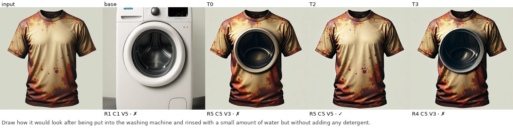

**PhyEditBench · Phase_Changes** (`phy/State_Change_&_Environment/Phase_Changes/TypeB/219`, mean Δ +0.76)

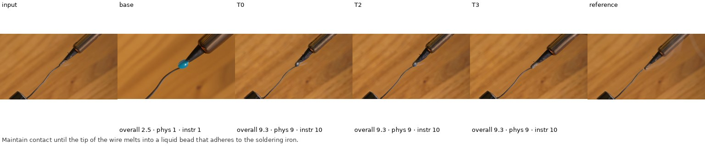

**PhyEditBench · Rotation_&_Rolling** (`phy/Rigid_Body_&_Interaction/Rotation_&_Rolling/TypeE/180`, mean Δ +0.75)

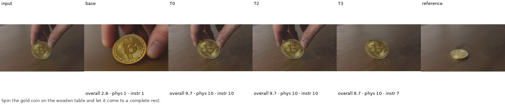

**PICABench · Causality** (`pica/489`, mean Δ +0.75)

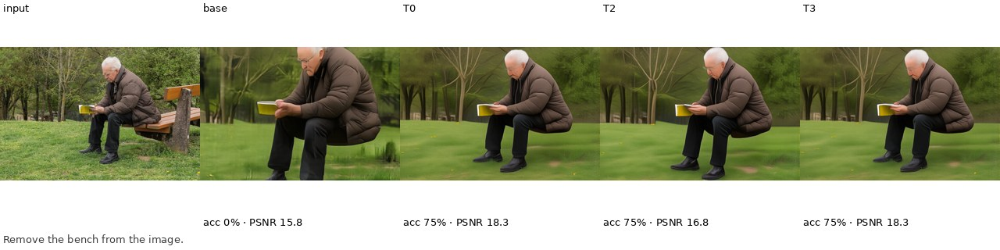

### A · Target: clearest losss

**RISEBench · Structural Deformation** (`rise/causal_reasoning_2`, mean Δ -1.00)

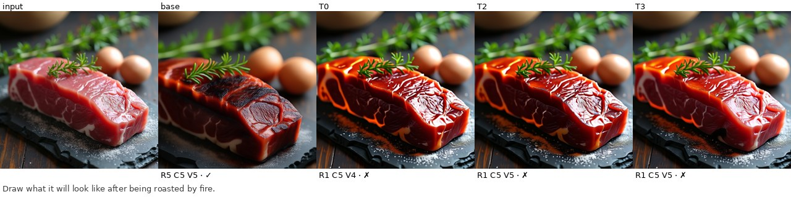

**RISEBench · Structural Deformation** (`rise/causal_reasoning_43`, mean Δ -1.00)

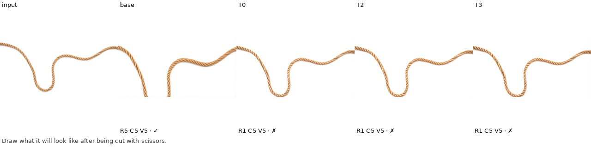

**RISEBench · Chemical and Biological Transformation** (`rise/causal_reasoning_70`, mean Δ -1.00)

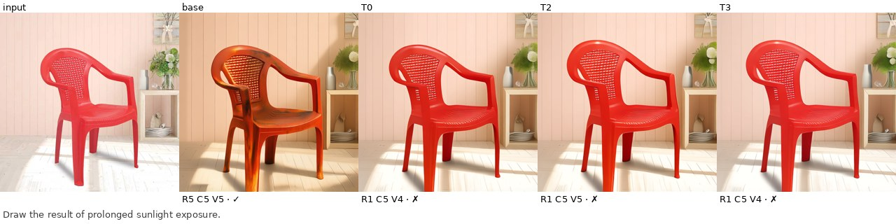

**RISEBench · State Transition** (`rise/causal_reasoning_12`, mean Δ -0.95)

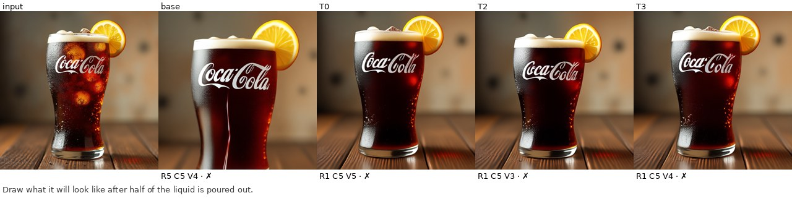

### B · Secondary: clearest wins

**RISEBench · Structural Inference** (`rise/spatial_reasoning_47`, mean Δ +0.98)

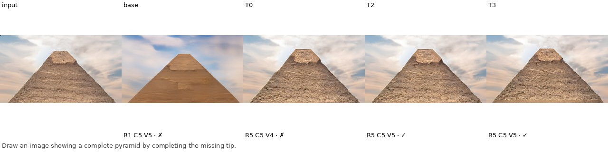

**RISEBench · Structural Inference** (`rise/spatial_reasoning_74`, mean Δ +0.60)

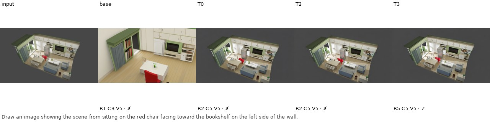

**RISEBench · Viewpoint Generation** (`rise/spatial_reasoning_48`, mean Δ +0.40)

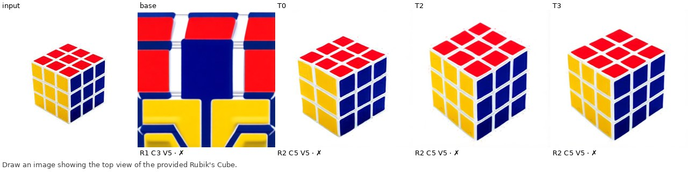

**RISEBench · Viewpoint Generation** (`rise/spatial_reasoning_68`, mean Δ +0.40)

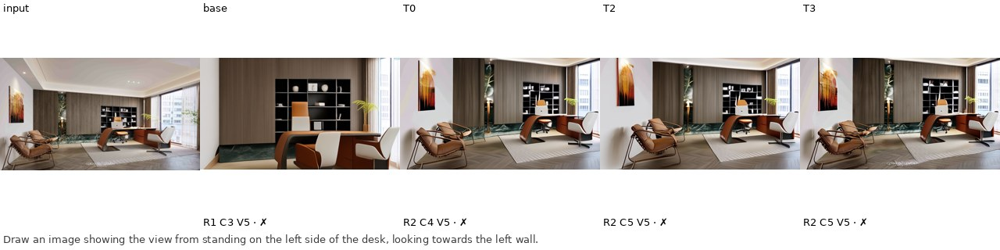

### B · Secondary: clearest losss

**RISEBench · Layout Reasoning** (`rise/spatial_reasoning_87`, mean Δ -1.00)

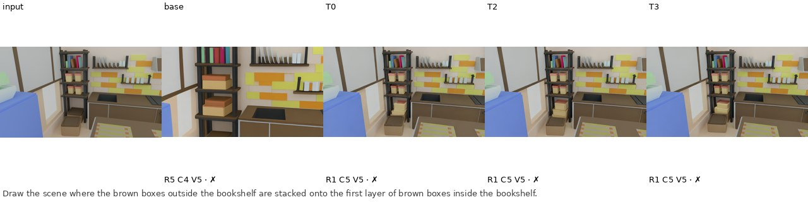

**RISEBench · Component Assembly** (`rise/spatial_reasoning_21`, mean Δ -0.87)

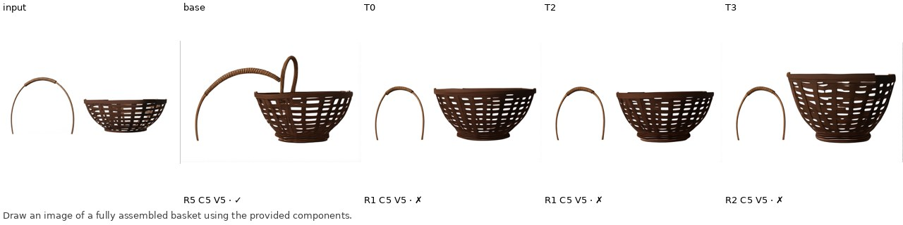

**RISEBench · Component Assembly** (`rise/spatial_reasoning_14`, mean Δ -0.80)

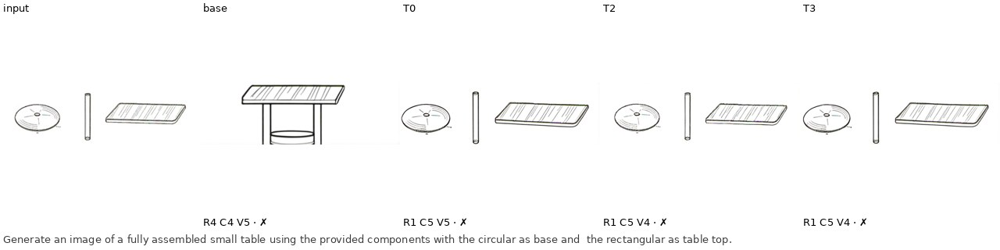

**RISEBench · Component Assembly** (`rise/spatial_reasoning_38`, mean Δ -0.80)

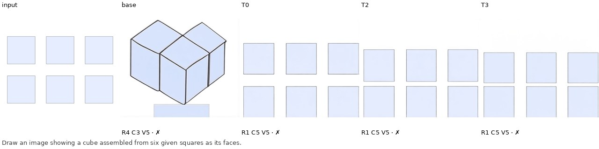

### C · Controls: clearest wins

**ImgEdit UGE · uge** (`uge/31`, mean Δ +1.00)

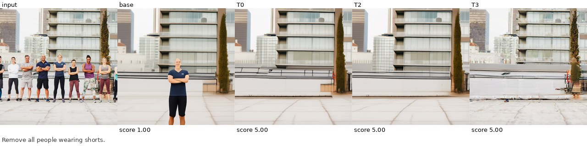

**RISEBench · Mathematical Derivation** (`rise/logical_reasoning_79`, mean Δ +0.97)

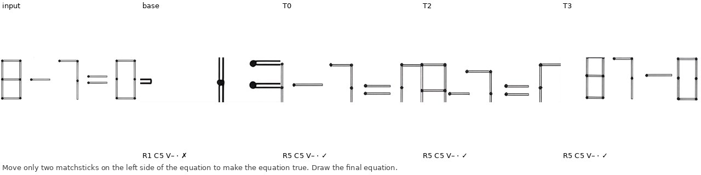

**RISEBench · Mathematical Derivation** (`rise/logical_reasoning_40`, mean Δ +0.67)

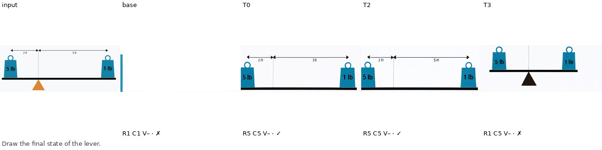

**ImgEdit Basic · adjust** (`imgedit/1112`, mean Δ +0.67)

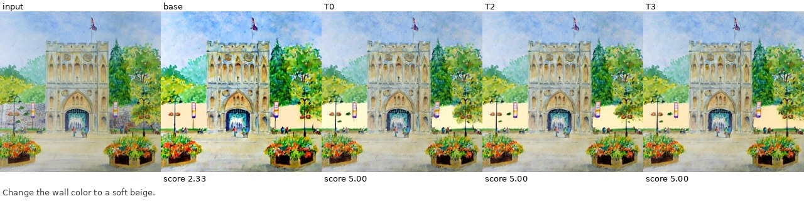

### C · Controls: clearest losss

**MagicBrush · turn1** (`mb/560472`, mean Δ -1.00)

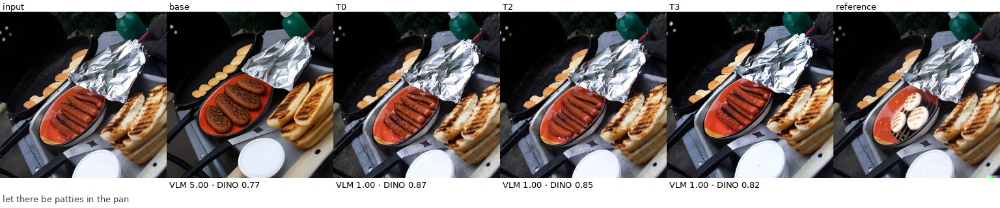

**RISEBench · Pattern Prediction** (`rise/logical_reasoning_47`, mean Δ -0.98)

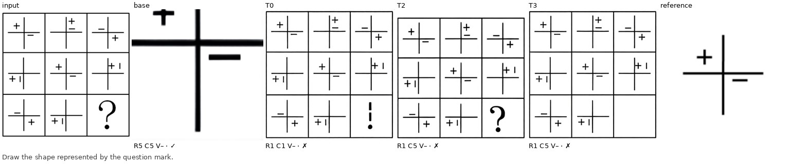

**MagicBrush · turn1** (`mb/47294`, mean Δ -0.75)

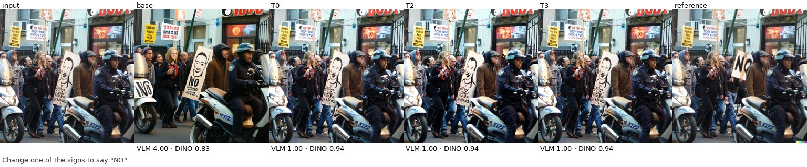

**ImgEdit UGE · uge** (`uge/28`, mean Δ -0.58)

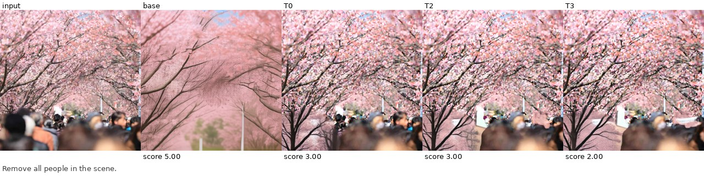

## Conclusions

### A · Target: refutes: T0, T3 significantly below base

Pooled over all 950 target tasks, T0 and T3 are significantly below base (T0 -0.026 [-0.046, -0.007], T3 -0.025 [-0.044, -0.007]) and T2 is not distinguishable from it (-0.010 [-0.028, +0.008]). Under the pre-registered rule this refutes the hypothesis for the current checkpoints.

PhyEditBench looks like a win at first: overall +0.40 for T2 with CI [+0.22, +0.60], largest on Type E and Deformation. The input-copy reference explains it. Returning the input unchanged scores 7.81 overall, above base (7.21) and every trained model, and it wins most clearly on Types D and E. With this judge, PhyEditBench rewards leaving the image alone, and the trained models change the input much less (edit magnitude 0.17 for base vs 0.10 to 0.11 for T0–T3). The gain comes almost entirely from Consistency (+0.71 for T2), so it is not evidence of better physics.

On the target benchmarks whose judge does penalise copying (PICABench, RISE Temporal/Causal, Anti-Physics; a post-hoc pool), all three trained models are clearly worse than base: T0 -0.090, T2 -0.065, T3 -0.088 (copy: -0.296). PICABench accuracy drops most in State transitions (-0.127 for T0) and Refraction. The laws video should help with most, Mechanics/Causality, are flat rather than improved. Meanwhile non-edited-region PSNR rises by +5.4 dB (T0), the same conservative-editing signature.

Anti-Physics: trained models follow counterfactual instructions less well (Instruction Following -1.26 for T0) and land between base and copy. Given the edit-magnitude drop, this reads as editing less, not as a stronger physical prior overriding the instruction.

### B · Secondary: refutes: T2 significantly below base

RISE Spatial drops for all three models (T2 -0.158 [-0.261, -0.057], the only Holm-significant one). Note that base's advantage here partly reflects the judge: copy lands at the same level as the trained models.

### C · Controls: inconclusive: no significant loss, but a loss of MDE size is not excluded

Controls do not show forgetting. ImgEdit Basic is slightly up (T2 +0.10), RISE Logical and UGE are noisy, and MagicBrush GT metrics improve (DINO +0.091 for T0) because its GT edits are small. The pooled CIs ([-0.058, +0.027] for T0) do not rule out a loss as large as the planned MDE, so the verdict is inconclusive rather than no harm. The judge clearly separates copy from real edits here (-0.289), so the controls are valid.

### Main caveats

- One judge family. The 30B judge is stable run to run (PICABench κ 0.96, PhyEditBench ±1 agreement 0.90), but a different judge (Qwen3-VL-8B) agrees only moderately (PhyEditBench Spearman 0.65, PICABench κ 0.58) and often ranks the four models differently on the 5% subset. Treat small differences as judge-dependent.
- PhyEditBench with this judge rewards inaction: the copy reference scores highest. Its numbers are reported for completeness and should not be read as physics quality.
- One seed per task at area-512 resolution, the resolution the T models were trained at. Base might do better at its native 1024², but that would break the identical-settings rule.
- The T models were trained on caption + 3 context frames → next frame, never on edit instructions. The comparison measures zero-shot transfer of video SSL into editing, not an edit-tuned model.
- The group-A-without-PhyEditBench pool and the copy reference were added after seeing the results. They are diagnostic, not pre-registered.

### Next steps

- Report edit-magnitude-matched comparisons, or add a copy-penalising judge check, before using PhyEditBench as evidence.
- Mix instruction-editing data into T0–T3 training (or add an edit-SFT stage) so the video prior can express itself through edits instead of suppressing them.
- Train T1/T4 and re-run this exact manifest (all scripts are resumable; only new models need generation and judging).
- Add AURORA-Bench (SSv2 slice) as an in-domain positive control, to check that the video signal is learned at all.
- Use a stronger or second judge (e.g. a GPT-class judge, or a Qwen3-VL-235B) on the target group to confirm the direction of the PICABench/RISE drops.
